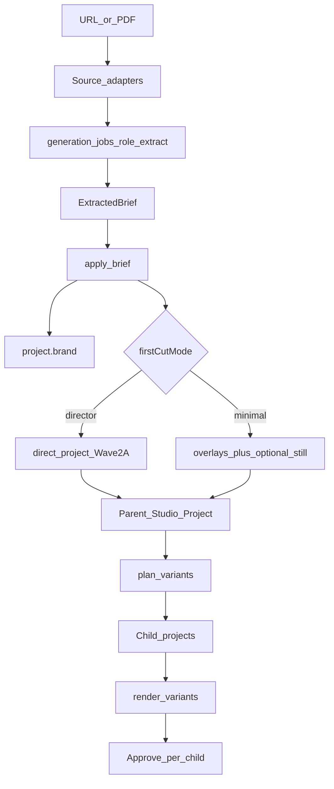

# Ad Generator and variants

> Contract for Vision Wave **2B**. Normative decisions: [ADR-0027](../adr/0027-ad-generator-and-variants.md). Founder journey: [ad-generator-flow.md](../ux/ad-generator-flow.md). Execution: `.cursor/plans/generated/09-ad-generator-variants.plan.md` · Epic [#148](https://github.com/Hepteract-Group/marketing-os/issues/148).

## Job to be done

Paste a **product URL** or upload a **PDF brochure** → system extracts an **ExtractedBrief** → apply onto a Studio Project as brand + first cut → plan a **variant matrix** (platform × hook × CTA) → render/Approve children without destroying the parent cut.

Reusable public-page stills live on the Product as **Extracts** ([product-extracts.md](./product-extracts.md), [ADR-0089](../adr/0089-product-extracts.md)). This doc stays the brief + variant matrix. Do not treat one og:image as the Extracts store.

Competitive bar (Pomelli): `URL → Business DNA → creatives`. We keep Remotion assembly, Path C chrome, cost gates, and Approve — extract is an on-ramp, not a parallel product.

## Domain objects

### ExtractedBrief

Structured extract (Zod). Groups: `source`, `brandCandidates`, `product`, `messaging`, `confidence`, optional `raw` digest.

```typescript
// Illustrative — implement in core/creative/src/brief/
type ExtractedBrief = {
  id: string
  source: { kind: 'url' | 'pdf'; uri?: string; blobKey?: string; title?: string; fetchedAt: string }
  brandCandidates: {
    displayName?: string
    primaryColor?: string
    accentColor?: string
    logoAssetId?: string
    stillAssetIds?: string[]
    fontFamily?: string
    defaultCta?: string
  }
  product: {
    name?: string
    oneLiner?: string
    benefits: string[]
    pricingNotes?: string
    socialProof: string[]
  }
  messaging: {
    hookCandidates: string[]
    ctaCandidates: string[]
    audienceHints: string[]
    tone?: string
  }
  confidence: { overall: number; fields?: Record<string, number> }
}
```

Low-confidence fields must be visible in the wizard so the founder can edit before apply.

### VariantSpec

```typescript
type AdPlatform = 'tiktok' | 'ig_reels' | 'yt_shorts' | 'meta_feed'

type VariantSpec = {
  platform: AdPlatform
  hookIndex: number // into brief.messaging.hookCandidates, or -1 if hookOverride set
  ctaIndex: number
  hookOverride?: string
  ctaOverride?: string
  aspect: '9:16' | '1:1' | '4:5'
  label: string // human, e.g. "TikTok · Hook 1 · CTA A"
  /** Parent named-branch tip at create time (ADR-0030 / #188). Optional for legacy. */
  sourceBranchId?: string
}
```

Create-time: `render_variants` stamps `sourceBranchId` from the parent’s `active_branch_id`. Variant Grid filters/labels by that id.
### Parent / child projects

| | Parent | Child (variant) |
|---|---|---|
| Role | Canonical first cut | Platform/hook/CTA fork |
| DB | `parent_project_id` null | `parent_project_id` = parent |
| Spec | optional `project.brief` | `variant_spec` JSONB + optional brief id |
| Assets | Owns extract + first-cut media | Copies AssetRef rows; **same blob keys** until override generate |
| Approve | Independent | Independent; attribution on Final |

## Pipeline



## Source adapters (#150)

Pure functions in `core/creative` (no UI):

| Adapter | Input | Output |
|---|---|---|
| **URL** | https URL | HTML/text digest + discovered logo/OG image URLs + color guesses |
| **PDF** | blob bytes | Text pages (capped) + embedded image candidates |

Adapters **do not** call LLMs for the final brief. The extract job may:

1. Run adapters (deterministic fetch/parse).
2. Persist intermediate assets (logo/OG) to Blob under the product/project.
3. When reasoner ≠ `mock-*`: capture a full-page screenshot (Playwright, SSRF-gated) and call a reasoner/vision profile with a **fixed schema prompt** to refine `ExtractedBrief` (estimate-before-generate; soft-fail to deterministic brief on error). See [ADR-0028](../adr/0028-extract-vision-enrichment.md).
4. Persist `extracted_briefs`; CI / “No LLM” (`mock-*`) skips step 3 (£0).

Fail closed on SSRF: allowlist http(s); block private/link-local IPs; size/time caps (screenshot navigation uses the same gate).

## Extraction job (#151)

- Extend `generation_jobs.role` CHECK to include `'extract'`.
- API: `POST /api/studio/projects/:id/extract` (or product-scoped create-then-extract) with `{ sourceKind, url? }`. Extract click is spend consent; enqueue fails only when monthly remaining cannot cover the estimate.
- UX: modal on start/complete + persistent banner while queued (ux-first rule).
- On ready: write `extracted_briefs` row; return brief id to client/agent.

## apply_brief (#152)

Studio Tool + optional HTTP helper:

1. Load brief; require product membership editor+.
2. Map `brandCandidates` → `project.brand` (ADR-0025). Import logo/stills as brand assets when present.
3. Attach `project.brief = brief`.
4. **firstCutMode:**
   - `director` — invoke Wave 2A `direct_project` when available.
   - `minimal` — seed hook + end_card overlays; optional one image generate + clip.
5. Return updated project + mode used.

## Variant planning and render (#154)

**`plan_variants`**

- Input: parent project id, axes selection (which platforms/hooks/CTAs), optional max count.
- Output: `VariantPlan { items: VariantSpec[], estimatedGbp, warnings[] }`.
- Default aspect from platform map:

| Platform | Default aspect | Suggested composition |
|---|---|---|
| tiktok | 9:16 | talking-head-60 |
| ig_reels | 9:16 | talking-head-60 |
| yt_shorts | 9:16 | talking-head-60 |
| meta_feed | 1:1 (or 4:5) | social-carousel (1:1) / talking-head-60 with 4:5 frame |

**`render_variants`**

- For each plan item: create child project (copy structure, apply hook/CTA overlays + composition size), share asset refs, enqueue render if requested.
- Soft cap 12 unless `confirmSpend` for larger matrices.

## Promote (#158)

`promote_variant_field` copies chosen fields from child → parent (`hook` text, `end_card`, selected clip trim, brand CTA). Never silent overwrite of entire parent. UI confirms field list.

## Cost (#159)

Estimate:

- Extract reasoner tokens + any image fetches.
- Per-variant: optional generate deltas + Remotion render estimate.

Gate before extract and before `render_variants`. Ledger via existing `cost_events`.

## Marketplace (#153)

Flagged stubs only (`MARKETPLACE_ADAPTERS`). No network purchase. Wave 2G owns real marketplace.

## Module map (target)

| Path | Owns |
|---|---|
| `core/creative/src/brief/` | ExtractedBrief Zod, parsers, apply mappers |
| `core/creative/src/variant/` | VariantSpec, plan/resolve, parent/child helpers |
| `core/creative/src/extract/` | URL/PDF adapters |
| `core/creative/src/tools/studio-tools.ts` | New tools above |
| `dashboard/.../AdGeneratorWizard.tsx` | Flow UI |
| `dashboard/.../VariantGrid.tsx` | Matrix + overrides drawer |
| `supabase/migrations/` | `extracted_briefs`, `parent_project_id`, `variant_spec`, role check |

## Security

- SSRF protections on URL adapter.
- PDF size limit (e.g. 20MB) and page cap.
- Extract and fan-out respect product membership + spend caps.
- Never commit fetched HTML with secrets into git; store digests in DB/Blob only.

## Non-goals (this wave)

- Live paid ads APIs / campaign spend.
- Marketplace billing.
- Cross-project asset browser beyond parent↔child.
- PiP B-roll track (#49) — separate.
- Replacing Intent/Director — we integrate when present.

## Local verification (epic)

1. Wizard: paste example.com (or fixture HTML) → extract → edit low-confidence fields → apply (minimal mode) → parent shows brand + hook/CTA.
2. Plan 4 variants → children appear linked to parent → open one in Studio → scrub.
3. Approve one child → Final has attribution ids.
4. Promote CTA from child → parent end card updates.
5. CI: mock extract profile; no live fetch in unit tests (fixture HTML/PDF).
