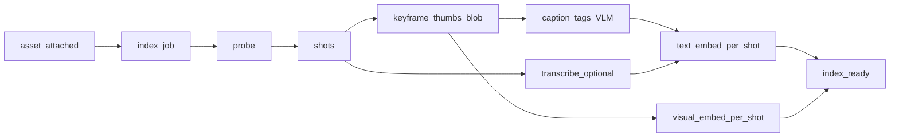

# Asset intelligence + Story Builder

Contracts: [ADR-0032](../adr/0032-asset-intelligence.md), [ADR-0052](../adr/0052-visual-shot-embeddings.md) (visual shot embeddings), [ADR-0053](../adr/0053-analyze-on-index.md) (analyze-on-index). Plan 10: [10-asset-intelligence.plan.md](../../.cursor/plans/generated/10-asset-intelligence.plan.md) (Wave 2C, epic [#162](https://github.com/Hepteract-Group/marketing-os/issues/162)). Plan 26: [26-intelligence-layer.plan.md](../../.cursor/plans/generated/26-intelligence-layer.plan.md) (Wave 2J). UX: [story-builder.md](../ux/story-builder.md). **Operator runbook:** [studio-asset-intelligence.md](../../core/runbooks/studio-asset-intelligence.md).

## Purpose

Turn a product’s uploaded / generated media into a **searchable working set**: shots, tags, captions, transcripts, **visual + text embeddings** — so chat, Director, Story Builder, assemble, compliance, and highlights all hit the **same index**.

## Vocabulary

| Term | Meaning |
|---|---|
| **Asset intelligence** | Index rows + pipeline that enrich `assets` for retrieval **and** analyze-on-index |
| **Shot** | Contiguous visual segment (video) or whole image |
| **Visual shot embedding** | Multimodal vector of a Shot keyframe (ADR-0052) |
| **Analyze-on-index** | `analyze_asset` + `asset_analyses` (ADR-0053) |
| **Index job** | Generation-style job that runs pipeline stages for one asset |
| **Story Builder** | Media bin **mode**: search / filter / preview / place / basket |
| **Director basket** | Ordered asset/shot picks fed into a Director preview (#174) |

## Data model (v1 sketch — #163)

```text
assets (existing, product_id + optional project_id)
  │
  ├─ asset_index_state     -- status, stage, last_error, caption, transcript excerpt
  ├─ asset_shots           -- t0/t1 or full; thumb blob_key (required for visual + analyze)
  ├─ asset_tags            -- (asset_id, tag) normalized
  ├─ asset_embeddings      -- kind text (1536-d, shot or whole) | visual (pinned dim, shot_id set)
  └─ asset_analyses        -- Wave 2J: schema results (segment | compliance | highlight | custom)
```

pgvector on Synawood Supabase. Thumbnails / frames in Azure Blob. Text embedding dim **1536** pinned in migration `0020` (`openai/text-embedding-3-small`). Visual dim is pinned in the Wave 2J migration if it is not 1536 (ADR-0052). Do not stuff a mismatched model into `vector(1536)`.

## Pipeline



- Trigger: **on attach** (upload, import, materialize). Reindex API rebuilds.
- Soft-fail per stage; chip shows progress / failed reason (#173).
- Face-detect behind env/flag default off (#176).

### Implemented (#164)

| Piece | Location |
|---|---|
| Role `'index'` on `generation_jobs` | migration `0021` |
| Enqueue + run probe/shots | `@synawood/creative/asset-intelligence` (`enqueue-index`, `run-index`, `probe`, `shots`, `persist`) |
| Auto on upload | `uploadProjectAsset` → `enqueueAndRunAssetIndexInline` (non-blocking; in-process until worker) |
| Shots v1 | Heuristic ~4s windows, max 24 (scene-detect later if needed) |

Later stages (caption → embed → transcript) append onto the same `asset_index_state` row; `#164` stops at `ready` after shots so Story Builder can show segments before VLM spend.

### Caption role (#169)

`resolveModelRef(profileId, 'caption')` picks the VLM. Starters: `openai/gpt-4.1-mini` (most profiles, including `founder-edit`); `openai/gpt-4.1` on `high-fidelity`; `mock-caption` on `ci-stub`. Distinct from `transcribe` (Whisper).

### Caption + tags (#165)

| Piece | Location |
|---|---|
| Normalize / parse / VLM call | `caption.ts` (`normalizeAssetTags`, `captionAssetWithVlm`) |
| Persist tags | `replaceAssetTags` (source `caption`) |
| Orchestrator | `runAssetIndexJob` after shots → `stage=caption` → write caption/tags → `ready` |

Soft-fail: VLM errors or skipped video (no keyframe yet) leave probe/shots intact; `last_error` records the note; status stays `ready`. Image stills are captioned now; video waits for shot thumbs.

### Transcribe (#167)

| Piece | Location |
|---|---|
| Excerpt + STT wrapper | `transcript.ts` (`transcribeAssetForIndex` → `transcribeMedia`) |
| Orchestrator | after caption → `stage=transcribe` → `transcript_excerpt` → `ready` |

Soft-skip images/other; soft-fail STT errors. Uses profile `transcribe` role (Whisper / mock-transcribe).

### Embeddings (#166)

| Piece | Location |
|---|---|
| Text embed + mock | `embed.ts` — model **`openai/text-embedding-3-small`**, dims **1536** |
| Persist | `replaceAssetEmbedding` → `asset_embeddings` (pgvector literal) |
| Orchestrator | after transcribe → `stage=embed` → text row → `ready` |

Visual embed soft-skipped until shot thumbs exist. Soft-fail embed errors keep probe/shots/caption/transcript.

### Per-shot embeddings + transcript windows (#515)

| Piece | Location |
|---|---|
| Segment timestamps | `asset_index_state.transcript_segments` jsonb (migration `0028`) |
| Window helper | `transcriptWindowForShot` — overlapping Whisper segments for a Shot |
| Persist | `replaceAssetEmbedding({ shotId })` — unique index already on `(asset, kind, model, shot)` |
| Retrieval | `find_moments` windows speech onto shots; `match_shot_embeddings` RPC (whole-asset `match_asset_embeddings` stays `shot_id is null`) |

Missing embeddings / RPC → tag/caption/window fallback. Dims stay **1536** / `openai/text-embedding-3-small`.

### Wave 2J — visual shot embeddings (ADR-0052)

Visual was skipped in #166 / #515. Plan 26 makes it required:

1. Extract a keyframe per Shot → Azure Blob → `thumb_blob_key` (no silent null). **[#580](https://github.com/Hepteract-Group/marketing-os/issues/580) writes thumbs.** Mid-window JPEG for video; still copy for images. Extract failures stay on `last_error` and the Media bin chip. Visual rows are still a later slice.

2. Profile role `embed_visual`: multimodal embedder (text query + keyframe, same space). **Pinned (#581):** `google/gemini-embedding-2` at 1536-d Matryoshka; `ci-stub` → `mock-embed-visual`. New column/table if dim ≠ 1536.
3. Write `kind=visual` rows with `shot_id` set. Caption-then-text-embed does **not** count. **[#582](https://github.com/Hepteract-Group/marketing-os/issues/582) writes visual rows** after thumbs; missing thumb or embed API error stays `ready` with a `last_error` note.
4. `find_moments` fuses visual + per-shot text (RRF), then keyword fallback.
5. Backfill via reindex / index-missing.

`ci-stub` uses a mock visual vector of the pinned dim.

### Wave 2J — analyze-on-index (ADR-0053)

One tool `analyze_asset` (prompt + JSON schema over asset or window). Persist `asset_analyses` (`kind`: `segment` | `compliance` | `highlight` | `custom`). Consumers: semantic shots, visual compliance, highlight ranking, critic/library Q&A, **motion scene plans** (`motionScenePlanFromAnalyses` — highlight/segment rows → Sequences; empty analysis → type-led ads). Analyze never stamps cut review.

Library Analyze is extra eyes on indexed files. It never stamps cut review. A make-video turn still needs `inspect_preview` on this project’s player (ADR-0051). Skipping inspect still fails the turn.

## Tools

| Tool | Role |
|---|---|
| `find_assets` | Semantic + filter search over product index (#168) |
| `find_moments` | Shot-level Moments: windows + tags/captions + per-shot **text and visual** embeddings, RRF fusion (#513, #515, #583) |
| `list_assets_by_tag` | Exact / prefix tag listing (#168) |
| `describe_asset` | Return caption, tags, shots, transcript snippet for one id (#168) |
| `analyze_asset` | Prompt + JSON schema over asset/window → `asset_analyses` (ADR-0053). Highlight/segment JSON maps to a `MotionScenePlan` for authored Sequences (#1200). Never stamps `inspect_preview`. |

HTTP mirrors search/reindex/status for the dashboard (#170). Semantic rank uses RPC `match_asset_embeddings` (migration `0022`) with in-process cosine fallback for tests. Hits farther than `MAX_TEXT_SEMANTIC_DISTANCE` (0.55) are dropped (#443); caption/tag/**filename** keyword matches still surface (#445). Unindexed Library assets are backfilled via `POST /api/studio/assets/index-missing`.

## HTTP (#170)

| Method | Path | Auth | Notes |
|---|---|---|---|
| `GET` | `/api/studio/assets/search?productId=&q=` | viewer | Semantic hits |
| `GET` | `/api/studio/assets/by-tag?productId=&tag=` | viewer | Exact tag; `prefix=true` optional |
| `GET` | `/api/studio/assets/[assetId]/index?productId=` | viewer | Caption, tags, shots, transcript |
| `POST` | `/api/studio/assets/[assetId]/reindex` | editor | Body `{ productId, projectId?, modelProfileId? }` → enqueue + run inline |
| `POST` | `/api/studio/assets/[assetId]/analyze` | editor | Body `{ productId, prompt, schema, shotId?, startMs?, endMs?, confirmSpend? }` — same as `analyze_asset` (#586) |
| `GET` | `/api/studio/assets/[assetId]/analyze?productId=` | viewer | Latest `asset_analyses` rows (#586) |
| `GET` | `/api/studio/assets/index-status?productId=&projectId=` | viewer | Batch status for Media bin chip (#173) |
| `POST` | `/api/studio/assets/index-missing` | editor | Backfill unindexed + missing thumbs/visual (#445 / #584) |

Product-scoped (ADR-0032). Upload remains `POST /api/studio/assets` (project form).

## Indexing chip (#173)

Persistent banner in Media bin while any asset is `pending`/`indexing`, or when failures need Retry. Polls `index-status` (survives reload). Never treats client-only flags as ready.

## Story Builder

See [story-builder.md](../ux/story-builder.md). Mode lives inside Media bin (ADR-0016); does not replace timeline/chat.

### Mode UI (#171)

- Media tab: **Library | Story** segmented control.
- Story: debounced semantic search + tag chips from hit tags; Place / Reference actions.
- Empty index CTA points to Library upload + indexing chip. Preview modal is #172.

## Consumers

- Contextual suggestions (ADR-0029): alternate takes via `find_assets`
- Director basket (#174): multi-select → ordered picks → **Use in Director** (chat priming) — **done**
- Chat: tools available in harness after #168

## Cost (#175)

Caption (VLM), text embed, **visual embed**, transcription, and **analyze** estimate before spend. Probe + shot detect stay free/heuristic. Keyframe extract is cheap local (ffmpeg / media-parser); treat as free unless a paid encoder is required.

- Reindex / Retry: `confirmSpend: true`.
- Upload auto-index: may soft-skip caption and **visual** near caps (`allowUnconfirmedPaid`) while still writing probe/shots/**thumbs** and **text** embeddings.
- Paid stages write CostEvents (`caption` / `transcribe` / `embed` / `embed_visual` / `analyze`). See [pricing-and-cost.md](./pricing-and-cost.md).

## Local verification (epic exit)

Operator path: [studio-asset-intelligence.md](../../core/runbooks/studio-asset-intelligence.md).

1. Upload 2–3 videos + stills → indexing chip → ready (thumbs + visual rows when paid stages ran).
2. Story Builder search “product” / tag filter → Place one shot on timeline.
3. Chat `find_moments` for an appearance query → `shotId` + in/out; `place_shot` trims that window.
4. `analyze_asset` (ci-stub) or `POST /api/studio/assets/<id>/analyze` writes `asset_analyses`.
5. `npx supabase db reset` applies pgvector + `0040_asset_analyses` cleanly.
