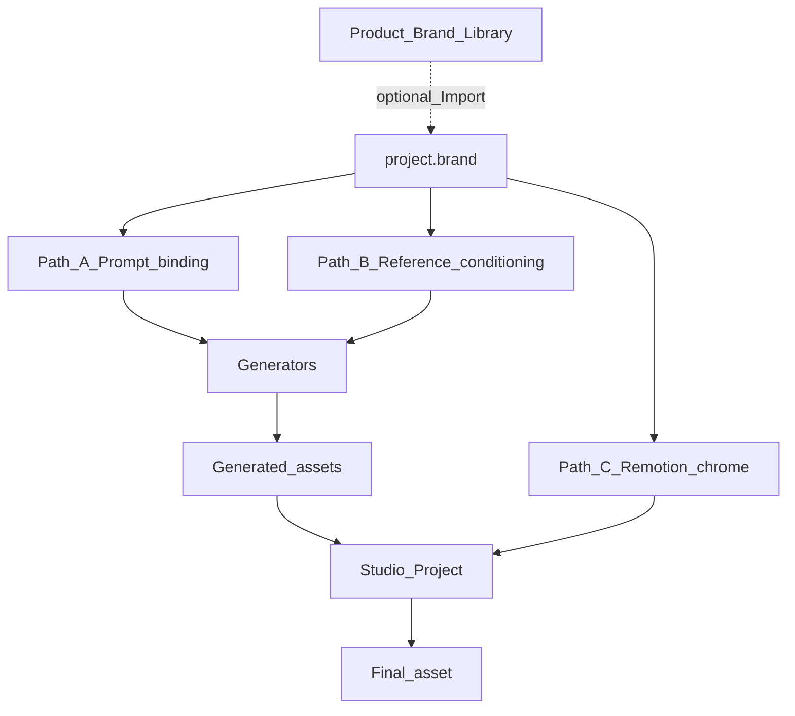

# Brand in generated media

How brand assets land in AI images, video clips, and Final exports. Brand is not a hope in a prompt — it is bound through three deliberate paths.

**Studio contract (ADR-0025):** source of truth is **`project.brand`** on the Studio Project. New projects start with no brand. Founders edit brand in Brand Studio (upload + planes). Optional **Import product brand** copies from a Product Brand Library (API/blob). Disk kits under `products/{name}/brand-kit/` seed that library for ops — they are not the live Studio attach path.



## Brand as the contract

### Per project (`project.brand`)

Resolved asset ids + tokens the Studio Agent and compositions read:

| Field | Used by |
|---|---|
| Logo asset id(s) | Path B refs, Path C overlays |
| Still asset id(s) | Path B image/video refs |
| Colors / font / CTA / mood | Path A tokens, Path C props |
| Chrome layout (corner, scale, margin) | Path C placement |
| Voice id | TTS Generator |

Every `generate_*` and Remotion composition reads `project.brand` — the agent should not re-paste logo URLs from chat.

### Product Brand Library (optional import)

Product-scoped library (blob + `products.brand_library` metadata), seedable from `products/{name}/brand-kit/` for bootstrap. Import copies assets into the project; the project then owns them and can replace any item.

Disk kit artifacts (seed inventory):

| Artifact | Used by |
|---|---|
| `logo/` | Library seed → Path B/C after import or manual upload |
| `colors.json` / `fonts/` / `stills/` / `voice.json` / `style.json` / `manifest.json` | Library seed tokens |

## Path A — Prompt binding (soft brand)

Before any Image/Video Generator call, the adapter builds a **BrandPromptContext** from `project.brand` + `product-marketing.md` excerpt:

- Palette names/hex, mood line, forbidden claims
- “Do not invent product UI; use provided references for UI”
- Channel aspect / length hints from the Brief

This improves style coherence. It does **not** guarantee a correct logo mark — models hallucinate wordmarks. Treat Path A as necessary but insufficient.

## Path B — Reference conditioning (hard brand into generation)

Generators that support reference / image-to-image / image-to-video must accept brand assets as **conditioning inputs**, not only text:

| Generator | Brand refs |
|---|---|
| Image | Logo + optional still(s) + color chip sheet as reference images when the provider supports it |
| Video clip | Prefer **image-to-video from a brand still** or a just-generated branded still, over text-only video |
| TTS | brand `voiceId` (not a random default) |

Adapter input shape (conceptual):

```ts
type GenerateImageInput = {
  prompt: string
  brand: BrandPromptContext
  referenceAssetIds: string[]  // from project.brand / prior assets
  aspectRatio: string
}
```

Rules:

- Product UI shots → use brand stills as refs or as the asset itself (skip gen).
- Conceptual / metaphorical B-roll → Path A + optional logo ref; logo still applied again in Path C.
- If a provider cannot take refs, degrade to Path A + **mandatory Path C**; log `brandRefsUnsupported: true`.

## Path C — Remotion chrome (guaranteed brand on Final asset)

Always applied on export for v1 compositions when `project.brand` is set, regardless of what Generators drew:

- Logo lockup (corner / end card; placement from chrome layout when set)
- Brand colors on captions, hook title, lower thirds
- Brand fonts for on-screen type
- End card CTA from brand / Brief
- Safe margins per channel

Path C is the **correctness floor**. Generators may only add B-roll; chrome comes from project brand.

## Decision table (agent + tools)

| Need | Prefer |
|---|---|
| Show real product UI | Brand stills → `add_clip` (no Image Generator) |
| Infographic with brand colors/type | Generate conceptual base (A/B) → Remotion text/logo (C) |
| Synthetic ad, no footage | Still(s) via A/B → optional video from still (B) → full C |
| Logo must be accurate | Never rely on Path A alone — Path C overlay (and B ref if available) |

## Studio Tools involved

| Tool | Brand role |
|---|---|
| `import_product_brand` | Optional copy from Product Brand Library → `project.brand` |
| Brand Studio (UI) | Primary: upload/edit logo, stills, colors, type, CTA, chrome |
| `generate_image` / `generate_video_clip` | Require `project.brand`; pass refs + BrandPromptContext |
| `generate_voiceover` | Use brand `voiceId` |
| `set_end_card` / `set_hook_title` | Path C props from brand tokens |
| `render_export` | Composition reads `project.brand` for chrome |

## System-design implication

Product Brand Library and disk seed kits live in **Product context**, not in `core/creative/`. Core Generators are product-agnostic adapters; they only receive a resolved `BrandPromptContext` + reference asset ids. Onboarding a new product = seed library + marketing doc, not new generator code.

## Failure modes

- Agent generates without `project.brand` → tools **reject** with a clear error (open Brand Studio or Import). Do **not** auto-attach from disk.
- Model draws a wrong logo → Path C covers the mark; optional vision check later (not v1 required).
- Missing library / incomplete seed → explicit error; do not silently ship unbranded Final assets when brand was expected.
