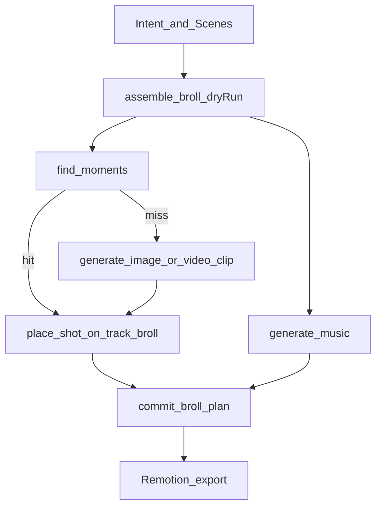

# Intelligent B-roll assembly

Contracts: [ADR-0047](../adr/0047-intelligent-broll-assembly.md), [ADR-0048](../adr/0048-live-video-clip-generator.md). Plan: [25-intelligent-broll.plan.md](../../.cursor/plans/generated/25-intelligent-broll.plan.md). How video layers: [video-generation.md](./video-generation.md). Asset index: [asset-intelligence.md](./asset-intelligence.md). PIP lane: [ADR-0046](../adr/0046-broll-pip-track.md). **Operator runbook:** [broll-assembly.md](../../core/runbooks/broll-assembly.md).

## Purpose

Make the Studio Agent produce a **30–120s ad with video, music, and brand** (ADR-0049). Use indexed shots when they exist; generate video (including text-to-video) and music until the ad is complete. How the file is encoded is not the product.

## Vocabulary

| Term | Meaning |
|---|---|
| **Shot** | Indexed segment of an asset (`asset_shots`) |
| **Moment** | A retrieved Shot (optional transcript window) the agent can place |
| **B-roll assembly** | Library-first loop that fills `track_broll` |
| **Generate-to-fill** | New image/video clip only for unmatched beats or holes |
| **BrollPlan** | Preview payload from `assemble_broll` (dryRun default) |

Avoid: calling Scenes “shots”; a graph DB; shipping an unbranded silent clip as the ad.

## Loop

## Tools (plan 25)

| Tool | Role |
|---|---|
| `find_moments` | Product-scoped shot search (query / tag / scene role / transcript) |
| `place_shot` | `add_clip` on `track_broll` with trim from the Shot |
| `assemble_broll` | Draft `BrollPlan`; `dryRun` default true |
| `commit_broll_plan` | Apply plan: place, generate-to-fill jobs, music, scene assign |
| Existing | `find_assets`, `generate_image`, `generate_video_clip` (text-to-video and image-to-video), `generate_music`, `assign_clip_to_scene`, `trim_clip`, `remove_clip` |

## UX (must not hide in a pill)

- **Modal** on assemble start + when the plan is ready (founder can minimize).
- **Persistent banner** while video Generation Jobs run (survives reload).
- Plan shows: library Moments vs generate-to-fill rows vs music, with £ estimate.
- Commit with £>0 requires Confirm spend.
- PIP lane updates after commit; A-roll talking-head is unchanged unless the plan says replace.

## Out of scope

- MCP (#20 remainder). Live Postiz is Plan 29 / #787, not this wave.
- Graph database
- Auto-apply plans
- Video tool enabled on `founder-edit`
- Clips longer than profile `maxVideoSeconds` in one generate
