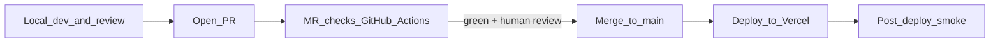

# CI/CD

Two pipelines, one boundary: **MR checks** must pass before merge; **deploy** happens after merge. Local-first still comes first — CI is a safety net, not the primary review loop ([local-first.md](./local-first.md)).

See [ADR-0012](../adr/0012-ci-cd.md).



## Pipeline 1 — MR checks (GitHub Actions)

Trigger: `pull_request` to `main` (and pushes to the PR branch).

Purpose: fast, deterministic gate. No secrets that could leak; no production writes.

### Jobs (run in parallel where possible)

| Job | Command (target) | Gate |
|---|---|---|
| Install/cache | `npm ci` | Must pass |
| Typecheck | `tsc --noEmit` | Blocking |
| Lint | `eslint .` / `next lint` | Blocking |
| Format | `prettier --check` | Blocking |
| Unit/integration tests | `vitest run` (or `npm test`) | Blocking |
| Migration check | `supabase db diff` / lint SQL in `supabase/migrations/` | Blocking |
| Build | `next build` (+ any Remotion bundle typecheck) | Blocking |
| Secret scan | `gitleaks` (or equivalent) | Blocking |

### Rules

- Generators stay offline in CI (`MODEL_PROFILE=founder-edit` with no paid keys → stub reasoner; image evals use `ci-stub`) — no real spend, no external flakiness.
- No live Supabase/Azure/Postiz calls in MR checks; use ephemeral local Postgres (service container) only if a test truly needs a DB.
- **Postiz:** `POSTIZ_ADAPTER=mock` and fixture HTTP belong in MR tests only. GitHub Actions has **no POSTIZ_API_KEY** and no `POSTIZ_BASE_URL`. Founders and Vercel never see mock keys or mock accounts (ADR-0064). Missing live config is an empty/error state.
- `npm run smoke` (local and post-merge) hits `/api/health`, `/studio`, `/login` — it does not call Postiz. Optional Docker Postiz smoke is operator-only ([postiz-hosting.md](../../core/runbooks/postiz-hosting.md)), never required in CI.
- Deterministic and fast (target < ~5 min). Heavy Remotion encodes are **not** run in MR CI.
- Required status checks configured on `main` branch protection → PR cannot merge red.
- Agents may self-merge after higher-model review and green required checks (`AGENTS.md`).

### Example skeleton (illustrative)

```yaml
name: mr-checks
on:
  pull_request:
    branches: [main]
jobs:
  checks:
    runs-on: ubuntu-latest
    env:
      MODEL_PROFILE: founder-edit
    steps:
      - uses: actions/checkout@v4
      - uses: actions/setup-node@v4
        with: { node-version: 22, cache: npm }
      - run: npm ci
      - run: npm run typecheck
      - run: npm run lint
      - run: npm run test
      - run: npm run build
      - uses: gitleaks/gitleaks-action@v2
```

## Pipeline 2 — Deploy (after merge)

Trigger: merge to `main`.

### Chosen model: Vercel Git integration (auto Production; Preview opt-in)

- Vercel is connected to `Hepteract-Group/synawood` (scope `hosted-vercel-team`; formerly `marketing-os`).
- **Push/merge to `main` → automatic Production deploy.**
- **PR/branch pushes do not auto-build.** Preview is **manual** when the founder wants a shareable URL ([ADR-0017](../adr/0017-vercel-main-only.md), [vercel-deploy.md](./vercel-deploy.md)).
- PR review stays **localhost + MR checks** by default.

### What still needs a step (GitHub Actions post-merge job)

Vercel auto-build does not run our DB migrations or smoke. A `push: main` workflow handles ops that Vercel won't:

| Step | Command | Notes |
|---|---|---|
| Apply migrations | `supabase db push --db-url` | Synawood Postgres URI only (`SUPABASE_DB_URL`) — **no** account access token |
| Await Vercel deploy | Poll Vercel deployment status for the commit | Optional; or trust Vercel |
| Post-deploy smoke | `npm run smoke` against `PROD_BASE_URL` | `/api/health` (app+DB), `/studio` → login, `/login` 200 |
| Notify | Comment/log result | Optional |

```yaml
name: post-merge
on:
  push:
    branches: [main]
jobs:
  release:
    runs-on: ubuntu-latest
    steps:
      - uses: actions/checkout@v4
      - uses: actions/setup-node@v4
        with: { node-version: 22, cache: npm }
      - run: npm ci
      - run: npx supabase db push --yes --db-url "$SUPABASE_DB_URL"
        env:
          SUPABASE_DB_URL: ${{ secrets.SUPABASE_DB_URL }}
      - run: npm run smoke
        env:
          SMOKE_BASE_URL: ${{ secrets.PROD_BASE_URL }}
```

### Migration ordering caveat

App code and DB can deploy at slightly different times. Prefer **backward-compatible migrations** (expand/contract): add columns before code uses them; drop only after code stops. For risky changes, merge the migration PR first, let it apply, then merge the code PR.

## Environments

| Env | Source | DB | Blob | Model APIs |
|---|---|---|---|---|
| Local | dev machine | Supabase local/dev | Blob dev prefix | real keys or mock |
| Production | Vercel `main` only | Synawood Supabase prod | Blob prod prefix | real keys, caps on |

Preview / branch **auto**-deploys are **not** used; manual Preview is optional (ADR-0017).

- Env vars set in Vercel per environment; names mirrored in `.env.example`.
- Never point Preview/Prod at the private example’s Supabase.

## Secrets (GitHub Actions + Vercel)

- GitHub: `SUPABASE_DB_URL` (Synawood Postgres URI), `PROD_BASE_URL`. Only in post-merge job. **Do not** use a personal `SUPABASE_ACCESS_TOKEN` for migrations.
- Vercel: runtime env (Supabase URL/keys, Azure Blob conn, model keys) per environment.
- MR checks job gets **no** production secrets.
- Secret scanning blocks accidental commits.

## Guardrails (lean)

1. MR cannot merge without green required checks + human review.
2. No real generator spend in CI.
3. Migrations run in post-merge job, not baked blindly into Vercel build.
4. Backward-compatible migrations preferred.
5. Local-first remains the primary review; Vercel Preview is **manual/opt-in** only (ADR-0017).
6. Prod smoke after deploy; failure is visible (not silent).

## Out of scope (until needed)

- Remotion encode farm in CI.
- Multi-region / blue-green deploys.
- E2E browser suite in MR gate (add Playwright smoke later; keep MR fast).
- Separate Fly pipeline for Postiz (Plan 29 — operator steps: [postiz-hosting.md](../../core/runbooks/postiz-hosting.md)).
