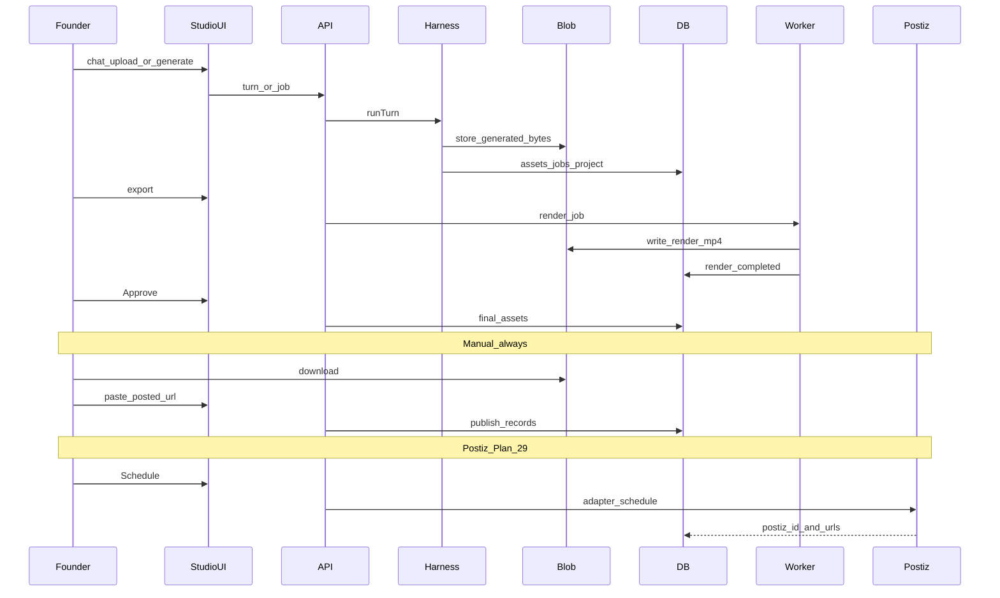

# Data flow — generate to distribute

## Status labels

**Project / candidate:** `drafting` → `rendering` → `needs_review` → `approved` | `killed`

**Publish:** `ready` → `scheduled` → `posted` | `failed` | `skipped`

See [storage-and-persistence.md](./storage-and-persistence.md) (Azure Blob + Supabase) and [distribution-and-postiz.md](./distribution-and-postiz.md). Local review: [local-first.md](./local-first.md).
