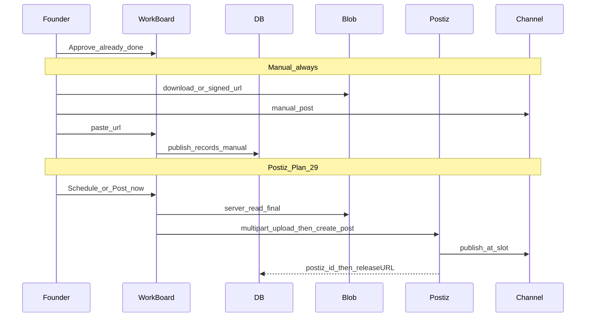

# Distribution and Postiz

How Final assets leave Creative Studio and reach channels.

Contract: [ADR-0063](../adr/0063-postiz-in-scope.md) (in scope), [ADR-0064](../adr/0064-postiz-public-api-adapter.md) (adapter), [ADR-0065](../adr/0065-schedule-after-approve.md) (Schedule UX). Plan 29 / epic [#787](https://github.com/Hepteract-Group/marketing-os/issues/787). **Operator runbook:** [postiz-hosting.md](../../core/runbooks/postiz-hosting.md).

Approve still does not post. Manual paste-URL stays. Postiz is the **scheduler**, not the creative database.

## Paths (both live)

| Path | Distribution | Tracking |
|---|---|---|
| **Manual** (always) | Download / signed URL, post yourself, paste URL | `publish_records` status `manual_posted` |
| **Postiz** (Plan 29) | `core/channels` adapter → Public API schedule/now | DB links `postiz_id`; poll (webhook optional) → `posted` + live URL |
| **Later** | Same + retargeting creatives as needed | Kill/scale from Synawood metrics, not from Postiz alone |

Ads, blog, and email are **not** Postiz in v1.

## End-to-end after Approve



## `core/channels/` adapter

Product-agnostic publish port. Conceptual:

```ts
type SchedulePostInput = {
  productId: string
  finalAssetId: string
  channel: 'linkedin_founder' | 'x_founder' | 'tiktok_organic' | …
  caption: string
  scheduledAt?: Date
}

type PublishAdapter = {
  schedule: (input: SchedulePostInput) => Promise<{ externalId: string }>
  getStatus: (externalId: string) => Promise<PublishStatus>
  cancel: (externalId: string) => Promise<void>
}
```

- **Manual:** `manualPublishAdapter` (DB row + “download + post yourself”).
- **Postiz:** `postizPublishAdapter` implements the same port (HTTP Public API). CI uses a mock adapter and fixtures; founders and Vercel never see mock accounts or mock keys (ADR-0064).

Work board **Schedule** talks to the port — not to Postiz SDKs in the client. Studio Agent does not call this port.

## What Postiz receives

- Media: Synawood server reads Azure Blob (SDK) and POSTs multipart `/upload` (not SAS upload-from-url, not base64).
- Caption: approved slot copy.
- Channel accounts: connected in Postiz; Synawood stores `product_channel_integrations` (Synawood `channel` → `postiz_integration_id`) — not social passwords.

v1 organic map: `x_founder` → `x`, `linkedin_founder` → `linkedin` / `linkedin-page`, `tiktok_organic` → `tiktok`.

## Tracking fields (minimum)

On each `publish_records` row:

- `final_asset_id`, `content_slot_id`, `channel`
- `status`: `ready` → `scheduled` → `posted` | `failed` | `skipped` (or `manual_posted`)
- `posted_url` / `external_url`, `posted_at`
- `postiz_id` (null while manual)
- `cost_roll_up_gbp` (optional denormalized from project)

Week board and metrics review read this table — not Postiz as source of truth. Poll is v1 for `releaseURL`; webhook is optional.

## Non-goals

- Postiz owning creative history (Synawood DB does).
- Auto-post on Approve (Approve ≠ Publish).
- Building our own multi-network scheduler.
- Ads channels through Postiz.
- MCP in this plan ([#20](https://github.com/Hepteract-Group/marketing-os/issues/20)).
