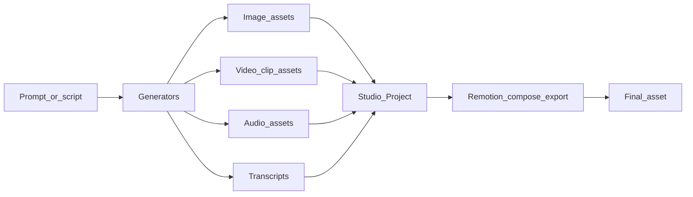

# Generators

Generators produce **assets** (images, video clips, audio, transcripts). They do not own the timeline. The Studio Agent calls them via Studio Tools; results become `AssetRef`s that `add_clip` places on the Studio Project. **Remotion then assembles** those assets into the Final asset.

## Two layers (do not collapse)

| Layer | Job | Examples |
|---|---|---|
| **Generate** | Create or derive media | Flux/Imagen, Kling/Runway/Luma, ElevenLabs, Whisper |
| **Assemble** | Edit, brand, caption, time, export | Studio Project + Remotion + FFmpeg helpers |

A pure “call Runway, download MP4” path is **not** Creative Studio — that skips brand end cards, captions, and Approve. A Remotion-only path with no Generators cannot invent B-roll or infographic stills when Brand kit screenshots are missing.

## Adapter catalogue

| Generator | Direction | Role | Provider posture (swappable) |
|---|---|---|---|
| **Image** | prompt (+ brand hints) → still | Infographics, B-roll frames, ad stills, carousel slides | e.g. Flux, Imagen, OpenAI images |
| **Video clip** | prompt / image-to-video → short clip | Synthetic B-roll, motion backgrounds, product-mood shots | e.g. Kling, Runway, Luma |
| **TTS** | script → audio | Voiceover when no founder take | e.g. ElevenLabs |
| **Transcription** | media → words/timestamps | Captions from founder or TTS audio | Whisper API (local later optional) |

All share: `generateX(input) → AssetRef` (uri, kind, probe metadata, cost/latency trace).

**QC gate (ADR-0018):** before attach/`ok`, `assertGeneratedAssetQc` rejects empty bytes and kind/content-type mismatches (and videos missing duration). Failures surface as tool errors in the same turn.

**Brand is required on generate**, not optional seasoning. Adapters take `brand: BrandPromptContext` and `referenceAssetIds` from the Studio Project after Brand Studio or `import_product_brand`. Full model: [brand-in-media.md](./brand-in-media.md), [ADR-0006](../adr/0006-brand-bound-generation.md), and [ADR-0025](../adr/0025-per-project-brand.md).

## When the agent should use which

- **Product UI truth** → Brand kit `stills/` via `add_clip` (do not invent fake the private example chrome with Image Generator).
- **Infographic / conceptual visuals** → Image Generator with Path A/B → Remotion type/logo (Path C).
- **Synthetic video** → Prefer image-to-video from a branded still (Path B), then Path C chrome.
- **No founder footage** → Video/Image Generators + TTS → assemble in Remotion with full brand chrome.
- **Founder talking-head** → upload raw take; Generators for B-roll only; Path C for captions/end card.
- **Always** → Remotion export applies Brand kit chrome (logo, colors, fonts, end card).

## Async generation

Image and especially video Generators are slow/expensive:

- Tools enqueue a **Generation Job** (parallel concept to Render Job) when latency > a few seconds.
- Status: `queued` → `generating` → `ready` | `failed`.
- On `ready`, asset is attachable; agent or UI calls `add_clip`. Founder review of the job and file is **AI Media** (`/ai-media`, [ADR-0061](../adr/0061-ai-media-surface.md) / [0062](../adr/0062-generated-asset-review.md)), not Usage.
- Never block the chat HTTP request on a 60s video diffusion call.
- Generation Job payload must snapshot `brand` + `referenceAssetIds` used (reproducibility).

## Cost and policy

Full design: [pricing-and-cost.md](./pricing-and-cost.md).

- Log provider, model, estimated cost, duration, and whether brand refs were applied.
- Estimate-before-generate; soft/hard caps from product budgets.
- Missing Brand kit → fail closed (no unbranded Final assets).
- Prefer Recipe A (founder footage) when near caps; video clips are the expensive line item.

**Stub note:** Image/Video/speech/transcribe stub model ids (`mock-*`, profile `ci-stub`) return placeholders for unit/CI evals. Product default is **`founder-edit`** (Gateway `openai/tts-1` + `openai/whisper-1`). The Media bin still labels stub generator images **Mock · generator**.

**Gateway models:** Switch **Image** beside chat Send among Gateway image profiles (`gemini-flash-image`, …). Grok canonical id `spacexai/grok-imagine-image` (ADR-0085). Switch **Reason** independently (`reasoner_model_id`). Switch **Video** independently (`video_model_id` — family adapters, ADR-0084). Frozen ids cannot spend. Image maps to `model_profile_id` (tools/limits); Reason and Video do not overwrite each other. Requires `AI_GATEWAY_API_KEY`. CI uses `MODEL_PROFILE=founder-edit` and falls back to the stub reasoner when no keys are present. Catalogue: [gateway-catalog.md](./gateway-catalog.md).

Paid make-an-ad: **Generation Plan** then confirm spend ([generation-plan.md](./generation-plan.md)).

**Gemini image models:** `google/gemini-*-image*` are multimodal chat models on Gateway — Studio calls them with `generateText` and reads `result.files`. Seedream / Grok Imagine use `generateImage`.

## Non-goals for Generators

- Generators do not Approve or publish.
- Generators do not replace Remotion as the composition/export core ([ADR-0002](../adr/0002-remotion-render-core.md)).
- Generators do not become a second timeline format — output is always an asset in the store.
- Generators are not allowed to be the sole guarantor of logo accuracy (Path C required).
