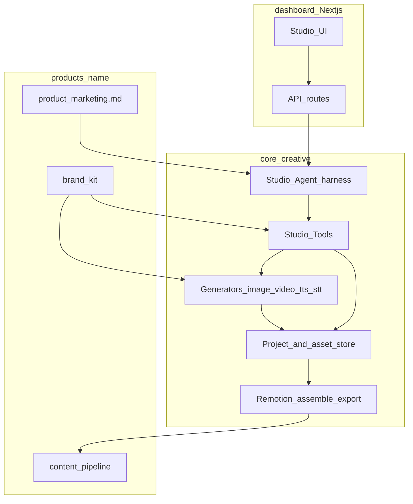

# Architecture overview

## Layers

1. **UI** — dashboard Studio: full-viewport editor (media bin, chat, Remotion Player + transport, editable timeline chrome — ADR-0016), review actions.
2. **API** — auth'd routes: chat turn, project CRUD, upload, Generation Jobs, Render Jobs, Approve.
3. **Harness** — tool-calling loop (see [agent-harness.md](./agent-harness.md)).
4. **Domain** — Studio Project + asset store + Studio Tools.
5. **Generate** — Image, Video Clip, TTS, Transcription adapters ([generators.md](./generators.md)).
6. **Assemble / export** — Remotion preview + async Render Job.
7. **Product** — brand + marketing context injected into prompts and generator hints.
