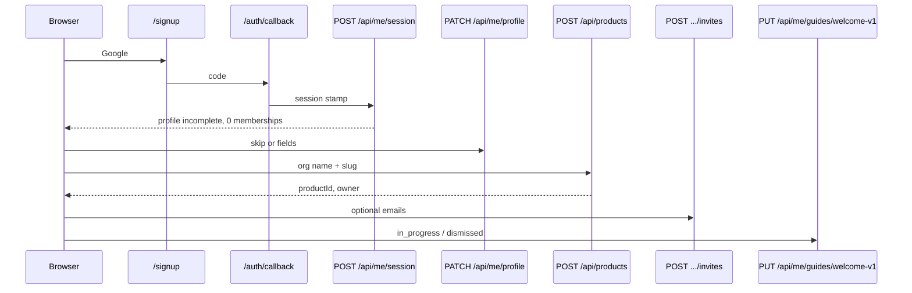

# SaaS identity, onboarding, and Guides

Technical contract for public signup, skippable profiles, Organization setup on existing Product tenancy, and dismissable Guides.

**Decisions:** [ADR-0067](../adr/0067-saas-public-identity.md), [ADR-0068](../adr/0068-organization-is-product-tenancy.md), [ADR-0069](../adr/0069-dismissable-product-guides.md).  
**Billing (wallet, plans, trial spend):** [billing.md](./billing.md), [ADR-0082](../adr/0082-hosted-billing-wallet-entitlements.md).  
**Current (pre-SaaS) behaviour:** [product-auth.md](./product-auth.md). This file is the **target**. Until `AUTH_ACCESS_MODE=saas` is on in a given env, [product-auth.md](./product-auth.md) still describes what production does.

UX: [saas-onboarding.md](../ux/saas-onboarding.md), [product-guides.md](../ux/product-guides.md).  
UI: [saas-auth-onboarding.md](../ui/saas-auth-onboarding.md), [product-guides.md](../ui/product-guides.md).

---

## 1. Current vs target

| Concern | Current | Target |
|---|---|---|
| Who may create a session | Allowlist or open invite | `AUTH_ACCESS_MODE`: `saas` (anyone) / `invite_or_allowlist` / `allowlist` |
| After auth, zero memberships | `/onboarding` create Product | `/onboarding/profile` then `/onboarding/organization` (same `POST /api/products`) |
| Person facts | Auth email only | `user_profiles` |
| “Organization” | Forbidden copy | UI label for `products` row |
| First-run teaching | None | `user_guide_progress` + catalogue in code |
| Last login | None | `user_profiles.last_login_at` for feature Guide eligibility |
| Members | `/settings/members` | Unchanged APIs; onboarding may call invite POST |

Do **not** introduce `organizations`, `org_members`, or Clerk.

---

## 2. Access mode

Env name: `AUTH_ACCESS_MODE`. Document in `.env.example` (no secrets).

| Value | Signup/login allowed when | Production default after flip | Local default |
|---|---|---|---|
| `saas` | Valid Auth user (rate limits apply) | Yes, once this program ships | Optional |
| `invite_or_allowlist` | Email on `AUTH_ALLOWLIST_EMAILS` **or** open `product_invites` row for that email | Until flip | Matches today’s intent |
| `allowlist` | Allowlist only | Emergency / staging lock | Founder realism |
| unset | Treat as `invite_or_allowlist` | Safe | Safe |

**Fail closed (keep):** `allowlist` or `invite_or_allowlist` + empty allowlist + `NODE_ENV=production` → deny (existing rule).  
**Must not fail closed:** `saas` + empty allowlist.

Helper: `dashboard/lib/auth-access-mode.ts`

```ts
export type AuthAccessMode = 'saas' | 'invite_or_allowlist' | 'allowlist';

export function getAuthAccessMode(): AuthAccessMode { /* parse env, default invite_or_allowlist */ }

export function emailMayAuthenticate(opts: {
  email: string;
  mode: AuthAccessMode;
  allowlisted: boolean;
  hasOpenInvite: boolean;
}): boolean;
```

Wire into:

- `GET`/`POST` `/api/auth/allowlist-check` (in `saas` return `{ allowed: true }` unless the user is suspended — v1 has no suspend table; omit)
- `/auth/callback` after session exchange
- Middleware on `/(app)/*` (session still required; **do not** sign out SaaS users for missing allowlist)
- Login/signup client pre-check

Invite accept routes stay authenticated; token remains the join grant.

---

## 3. Schema

New migration (next free number after current max). Names are contract; adjust types only with a follow-up ADR.

### 3.1 `user_profiles`

```sql
create table public.user_profiles (
  user_id uuid primary key references auth.users (id) on delete cascade,
  display_name text,
  job_title text, -- 'founder' | 'marketer' | 'editor' | 'other' | null
  intent text,    -- 'make_ads' | 'run_gtm' | 'exploring' | null
  onboarding_completed_at timestamptz,
  onboarding_skipped boolean not null default false,
  first_seen_at timestamptz not null default now(),
  last_login_at timestamptz,
  created_at timestamptz not null default now(),
  updated_at timestamptz not null default now()
);
```

Constraints:

- `job_title` check in (`founder`, `marketer`, `editor`, `other`) or null.
- `intent` check in (`make_ads`, `run_gtm`, `exploring`) or null.
- `display_name` trim; empty string stored as null.
- Trigger `updated_at`.

**RLS:** `select` / `insert` / `update` where `user_id = auth.uid()`. No delete from the client (cascade from Auth). Service role for session stamp.

**Not here:** `functional_role`, `product_id`, billing fields.

### 3.2 `user_guide_progress`

```sql
create table public.user_guide_progress (
  user_id uuid not null references auth.users (id) on delete cascade,
  guide_id text not null,
  status text not null,
  step_index int not null default 0,
  created_at timestamptz not null default now(),
  updated_at timestamptz not null default now(),
  primary key (user_id, guide_id)
);
```

- `status` in (`pending`, `in_progress`, `completed`, `dismissed`).
- `step_index` >= 0.
- RLS: own rows only, all verbs except delete-from-client (optional: allow delete for Settings “reset” = upsert `in_progress` / step 0 instead).

### 3.3 Unchanged tables

`products`, `product_members`, `product_invites` stay. Organization name **is** `products.name`. Optional `tagline` column **only if** a later task needs “what you sell”; do not block the program on it.

### 3.4 Indexes

- `user_profiles (last_login_at)` — not required at v1 volume.
- `user_guide_progress (user_id, status)` — optional.

---

## 4. Session start (login clock)

Feature Guides need the **previous** login timestamp.

`POST /api/me/session` (cookie auth):

1. `requireUser`.
2. Read `user_profiles`. If missing, insert `{ user_id }` with `first_seen_at = now()` (do not set `onboarding_completed_at`).
3. Let `previousLoginAt = row.last_login_at`.
4. Set `last_login_at = now()`.
5. Compute `eligibleGuides` (section 8) using `previousLoginAt`, `auth.users.created_at`, catalogue, and progress rows.
6. Return:

```ts
type MeSession = {
  user: { id: string; email: string };
  profile: UserProfile | null;
  memberships: Array<{ productId: string; name: string; slug: string; role: string }>;
  previousLoginAt: string | null;
  eligibleGuides: Array<{ id: string; kind: 'welcome' | 'feature' }>;
};
```

Call this from:

- `/auth/callback` after successful exchange (server redirect can `fetch` internally or the first authenticated layout can POST once).
- Dashboard root layout once per browser session (`sessionStorage` key `mos-session-posted`) so refresh does not smash `last_login_at` every 30s of polling.

**Do not** update `last_login_at` on every RSC navigation. Once per login / new browser session.

Email confirmation: password signup in `saas` mode requires Supabase “Confirm email” on hosted. Local may disable for DX; document in the PR.

---

## 5. Profile API

| Method | Path | Body | Result |
|---|---|---|---|
| `GET` | `/api/me/profile` | — | Profile or 404 empty object `{ exists: false }` |
| `PATCH` | `/api/me/profile` | `{ displayName?, jobTitle?, intent?, skip?: boolean }` | Upsert; if `skip` or any continue, set `onboarding_completed_at` |

Validation: zod. Unknown `jobTitle` → 400. `skip: true` may send empty fields; still stamps completed + `onboarding_skipped = true`. Continue with fields sets `onboarding_skipped = false`.

Idempotent. Replay Skip does not clear a filled name if they return via Settings.

**Settings later:** `/settings/profile` can PATCH the same resource. Not required for the first org-setup MR.

---

## 6. Post-auth routing (middleware + pages)

Replace “zero memberships → `/onboarding`” with a function `resolvePostAuthPath(session: MeSession, nextUrl: string): string`.

Priority (first match wins):

1. If path is public (`/login`, `/signup`, `/`, waitlist APIs, `/auth/callback`, `/invite/*`, `/api/health`) — leave it.
2. If no session → `/login?next=`
3. If `!profile.onboarding_completed_at` and path is not `/onboarding/profile` → `/onboarding/profile`
4. If memberships.length === 0 and no `invite` query and path is not `/onboarding/organization` and not `/invite/...` → `/onboarding/organization`
5. If memberships.length === 0 and invite token present → `/invite/[token]`
6. Else allow `/(app)/*`. Set `synawood-active-product` if missing (first membership).

`/onboarding` (legacy) **redirects** to `/onboarding/organization` so old links do not 404. Keep `CreateProductForm` internals.

**Guides never block middleware.** A pending Guide is a client overlay after the page loads.

**APIs:** JSON 401 without session; do not redirect APIs to onboarding (except `POST /api/products` which onboarding needs). Profile and session routes allowed without membership.

Allowlist sign-out: only when `emailMayAuthenticate` is false.

---

## 7. Organization setup (reuse Product APIs)

### 7.1 Create

Existing `POST /api/products` `{ name, slug }` remains the write path. Creator becomes `owner` + ADR-0037 founder functional role (keep current insert).

UI labels: Organization name, URL slug. Implementation: `CreateProductForm` copy + optional invite fields on the same page.

### 7.2 Invites from the org step

After 201 create:

```
for each email on the form (max 5):
  POST /api/products/{id}/invites  { email, functionalRole }
```

Failures: show which emails failed; **do not** roll back Product create. User is already owner. They finish invites in Settings → Members.

Empty invite list: redirect `/home` (or `/studio` if that remains default landing — prefer `/home` for SaaS; Studio is a nav item). Today post-create goes to `/settings/members`; that is acceptable if the toast says “Invite teammates anytime in Members.”

### 7.3 Join

`/invite/[token]` unchanged. After accept, `synawood-active-product` = that Product. Profile may already be completed.

Paste token on `/onboarding/organization` can keep the current “Have an invite?” field.

### 7.4 Skip organization

Server: 403/redirect back if `memberships.length === 0` and no valid token. There is no “I’ll do this later” that lands in Studio.

---

## 8. Guide engine

### 8.1 Catalogue (code)

`dashboard/lib/guides/catalogue.ts` (or `core/` only if tests need it without Next — prefer dashboard + a pure module `dashboard/lib/guides/eligibility.ts` with no `fs`).

```ts
export type GuideKind = 'welcome' | 'feature';

export type GuideStep = {
  id: string;
  title: string;
  body: string;
  route?: string;       // navigate before spotlight
  spotlight?: string;   // data-guide-id on a real control
};

export type GuideDefinition = {
  id: string;           // stable slug, e.g. 'welcome-v1'
  kind: GuideKind;
  title: string;
  summary: string;
  releasedAt: string;   // ISO
  includeNewUsers?: boolean; // feature only; default false
  audience?: 'all' | 'owner' | 'editor';
  steps: GuideStep[];
};

export const GUIDE_CATALOGUE: GuideDefinition[] = [ /* ... */ ];
```

Welcome v1 steps (copy in UX doc): Home, Studio, Members, dismiss reminder.

Feature example: `studio-chat-titles-v1` after that surface exists — only if we want existing users taught; new users skip unless `includeNewUsers`.

`GUIDE_FORCE_ID` env (local/preview): ignore eligibility and return that id for QA. Never set on production.

### 8.2 Eligibility (pure function)

```ts
export function selectEligibleGuides(input: {
  now: Date;
  previousLoginAt: Date | null;
  userCreatedAt: Date;
  memberships: { role: string }[];
  progress: Array<{ guideId: string; status: string }>;
  catalogue: GuideDefinition[];
  forceId?: string;
}): GuideDefinition[]
```

Rules:

1. Ignore guides with `releasedAt > now` (unless force).
2. Skip if progress status is `completed` or `dismissed`.
3. Welcome: at most one, latest `releasedAt`, only if `memberships.length > 0`.
4. Feature: `previousLoginAt === null || previousLoginAt < releasedAt`, and `now >= releasedAt`. If `userCreatedAt >= releasedAt` and `!includeNewUsers`, skip.
5. Audience: owner-only guides require owner membership on the **active** Product.
6. Sort welcome by newest `releasedAt`, features by oldest. Return **at most one** auto-prompt: welcome if eligible, else the oldest pending feature. Caller still takes `eligibleGuides[0]`.

`in_progress` is eligible (resume). `pending` is eligible.

### 8.3 Progress API

| Method | Path | Purpose |
|---|---|---|
| `GET` | `/api/me/guides` | `{ catalogueIds, progress, eligible }` |
| `PUT` | `/api/me/guides/[guideId]` | `{ status, stepIndex? }` |

Terminal statuses cannot move to `pending`. Settings “Replay” sets `in_progress` + `stepIndex: 0` from `completed` or `dismissed`.

### 8.4 Client

- `GuideHost` in the authenticated shell (not on `/login`, not on `/onboarding/*`).
- After `POST /api/me/session`, if `eligibleGuides[0]`, show start modal.
- Persist step via PUT on Next / Back / Dismiss / Complete.
- `sessionStorage['mos-guides-evaluated']` so SPA navigations do not re-open a dismissed modal in the same login. Full login (new session) evaluates again — dismissed stays dismissed via DB.

Spotlight: `data-guide="studio-nav"` on real nav items. If the node is missing, show the step card without a hole-punch (do not crash).

Studio: if `route === '/studio'`, navigate first; persistent chip “Guide in progress” in the shell (UX-first: survives modal close / reload). Chip opens the step card again. Chip is not the only status.

---

## 9. State machines

### 9.1 Onboarding

```text
[authenticated]
    │
    ├─ profile incomplete → Profile
    │         Continue/Skip → stamp onboarding_completed_at
    │
    └─ profile complete
              ├─ 0 memberships, no invite → Organization (create or paste)
              ├─ 0 memberships, invite   → Accept invite
              └─ ≥1 membership           → App (+ Guides)
```

### 9.2 Guide status

```text
(none) → pending | in_progress
in_progress → completed | dismissed | in_progress (step change)
completed → in_progress (replay only)
dismissed → in_progress (replay only)
```

---

## 10. Sequence: first signup



---

## 11. Security

- Profile and guide tables are user-scoped. No `product_id` on them (Guides are person-level by founder request: “when the user logs in”).
- Invite APIs keep owner checks (`requireProductRole`).
- `saas` mode does not disable RLS.
- Rate-limit signup at Supabase + optional Next rate limit on profile PATCH (same as other public-adjacent routes).
- Do not log raw emails in Guide analytics beyond existing audit patterns.
- `GUIDE_FORCE_ID` ignored when `VERCEL_ENV=production` unless the user is allowlisted (belt and braces).

Suspended users: out of v1. If we need a kill switch before billing, use `allowlist` mode or delete the Auth user.

---

## 12. Observability

Optional `audit_events` (if the table already supports user-only actions):

- `profile_completed` / `profile_skipped`
- `organization_created` (existing product create event if any)
- `guide_shown` / `guide_dismissed` / `guide_completed` (`payload.guide_id`)

If audit requires `product_id`, skip events until membership exists (welcome fires after org).

---

## 13. Tests (minimum)

| Layer | Cases |
|---|---|
| `emailMayAuthenticate` | all three modes × allowlisted × invite |
| `resolvePostAuthPath` | incomplete profile; zero members; invitee; returning |
| `selectEligibleGuides` | welcome once; feature next-login; new user skips old feature; dismissed stays; force id |
| `PATCH /api/me/profile` | skip stamps; validation |
| Members | invite from org step appears in list (integration or API test) |

No class-based services. Pure functions + route handlers.

---

## 14. Env names (document in `.env.example`)

- `AUTH_ACCESS_MODE`
- existing `AUTH_ALLOWLIST_EMAILS`
- `GUIDE_FORCE_ID` (dev/preview only)

---

## 15. File map (implementation, not this doc)

| Area | Likely files |
|---|---|
| Mode + middleware | `dashboard/lib/auth-paths.ts`, new `auth-access-mode.ts` |
| Session / profile / guides routes | `dashboard/app/api/me/**` |
| Profile UI | `dashboard/app/onboarding/profile/` |
| Org UI | existing onboarding form + copy |
| Guide host | `dashboard/components/guides/` |
| Catalogue | `dashboard/lib/guides/catalogue.ts` |
| Migration | `supabase/migrations/00xx_user_profiles_and_guides.sql` |

---

## 16. Relation to product-auth.md

When this program is **fully live** in an environment, treat this file as source of truth for access and onboarding routes. Keep [product-auth.md](./product-auth.md) for Google OAuth URIs, waitlist mail, `requireProductRole`, and cookie names — then add a one-line pointer at the top of that file to here.

Until then, production remain waitlist + allowlist as documented there.
