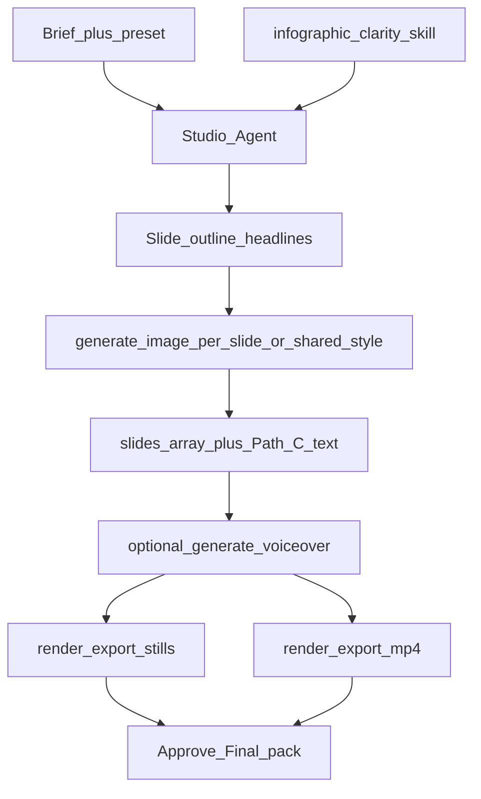

# Slideshow and infographic posts

Design for **Instagram / TikTok-style** still-led posts: sequenced slides (image + text), optional voiceover, dual export as **carousel stills** and/or **vertical slideshow video**.

This specializes Recipe C from [video-generation.md](./video-generation.md). Talking-head and synthetic B-roll remain separate compositions.

See [ADR-0013](../adr/0013-slideshow-infographics.md). UX: [../ux/slideshow-flow.md](../ux/slideshow-flow.md).

## What we ship

| Output | Use |
|---|---|
| Numbered stills (`01.png`…`N.png`) | Instagram carousel, LinkedIn document-ish carousels |
| Vertical MP4 (9:16) | TikTok / Reels / Stories — Ken Burns or hard cuts between slides + optional VO |
| Cover / thumb still | Feed thumbnail |
| Caption + alt text draft | Slot copy in Draft pack / publish record |

Raw AI images alone are **not** Final assets — Remotion (or still export pipeline) applies Path C brand chrome and typed text.

## Format presets (channel)

| Preset id | Aspect | Slide count | Notes |
|---|---|---|---|
| `ig_carousel_1080` | 1:1 or 4:5 | 3–10 (default 5–7) | Still pack primary; optional MP4 |
| `tiktok_slideshow_9x16` | 9:16 | 3–8 (default 5) | MP4 primary; stills secondary |
| `ig_story_9x16` | 9:16 | 1–5 | Shorter copy; safe zones for UI chrome |
| `linkedin_carousel_1080` | 1:1 or 4:5 | 3–8 | Slightly denser text OK |

Presets live in `core/creative/presets/` (product-agnostic). Brief picks `presetId` + channel.

## Slide layouts

Keep **overlay** (type on a full-bleed photo): `hero`, `point`, `stat`, `quote`, `cta`.

Also ship **compartments** so packs convert ([#1017](https://github.com/Hepteract-Group/marketing-os/issues/1017)):

| Layout | What the founder sees |
|---|---|
| `stack_media_top` | Photo band on top; type on a solid field below |
| `stack_type_top` | Type on a solid field; rounded image/infographic card below |
| `split_media_left` | Image left, type right |
| `split_media_right` | Type left, image right |

Image or type may sit in any compartment. Nested spreadsheet grids stay a **generated image** inside the media card — not a layout id. Video PIP/split (`set_pip_layout`) is a different surface.

`plan_slideshow` mixes overlay + stacked + split. Override with `set_slide`.

## Slide model (extends Studio Project)

When `compositionId` is `social_carousel` or `vertical_slideshow`, the project carries a first-class **`slides[]`** array (not only generic clips):

```ts
type Slide = {
  id: string
  order: number
  /** Background: generated still, brand still, or solid/gradient from brand tokens */
  backgroundAssetId?: string
  headline: string       // ≤ ~8–12 words; validated per preset
  body?: string          // optional; denser on LinkedIn preset only
  durationFrames: number // for MP4 timing; stills ignore but keep for VO sync
  transition: 'cut' | 'fade' | 'kenBurns' // kenBurns = slow zoom/pan on still
  voiceoverCue?: string  // line spoken while this slide shows (optional)
  textSafe: boolean      // composition validates margins
}

type SlideshowProjectExtras = {
  slides: Slide[]
  voiceoverAssetId?: string
  /** Auto-derived from cues + TTS, or manual */
  voiceoverMode: 'none' | 'per_slide' | 'continuous'
  captionDraft?: string
  altTextDraft?: string
}
```

Generic `tracks`/`clips` still hold the background assets and audio; `slides[]` is the authoring surface the agent and UI edit.

## Production path



1. Agent loads marketing skills (`infographic-clarity`, channel skill, `hooks-first-3s`).
2. `plan_slideshow` on **this** project (Video Suite converts in place). Do not `create_project` for a carousel unless they asked for a fresh cut — then the chat must open with `[name](/studio/{id})`.
3. `plan_slideshow` (or chat) → N headlines + optional body/VO cues.
4. Per slide: `generate_slide_background` with BrandPromptContext **or** reuse Brand kit still; Remotion draws **headline/body in Path C** (do not bake critical copy into the diffusion image when avoidable).
5. `generate_music` (instrumental bed on the audio track, duration covering the slideshow) unless a bed already exists. Skip `duck_music` unless there is VO.
6. Optional: `generate_voiceover` from concatenated cues; set `durationFrames` so audio fits (or trim VO).
7. `render_export` with targets: `stills` | `mp4` | `both`.
8. Approve → `final_assets` pack (multiple blob keys linked to one slot).

## Remotion compositions

| compositionId | Behaviour |
|---|---|
| `social_carousel` | Renders each slide as a frame sequence → PNG sequence; optional short MP4 of same |
| `vertical_slideshow` | 9:16 timeline; cuts/Ken Burns; captions optional; end card slide |

Shared slide renderer component: background + type hierarchy + logo lockup + safe margins from preset.

## Studio Tools (slideshow-specific)

| Tool | Purpose |
|---|---|
| `plan_slideshow` | Create/replace `slides[]` outline from Brief + skill |
| `set_slide` | Update one slide’s text / duration / transition |
| `reorder_slides` | Change order |
| `generate_slide_background` | Image gen for one slide (brand-bound) |
| `generate_music` | Instrumental bed on the audio track (slideshow Remotion `Audio`) |
| `set_slideshow_voiceover` | Attach VO asset or generate from cues |
| `render_export` | Accept `targets: ['stills','mp4']` |

## Quality gates (before Approve)

- Slide count within preset min/max.
- Headline length / overflow check (composition or layout probe).
- Path C logo + brand fonts applied.
- Safe margins for TikTok/IG UI (top/bottom).
- If VO: total slide durations ≥ VO length (or auto-extend last slide).
- Music bed on the audio track (Approve already fails `missing_music`).
- Cost under remaining cap (N images ≈ N generation events).
- No fake product UI in backgrounds when Brand kit stills exist for that claim.

## Cost posture

Slideshows are **image-heavy, video-model-light** — prefer this over Recipe B when budget is tight (`budget-aware-creative` skill). One shared style ref image can reduce variance; avoid regenerating all slides on every copy tweak (edit Path C text in Remotion first).

## Non-goals (v1)

- Drag-everywhere Canva editor.
- Auto-post carousels via Postiz until Plan 29 adapter supports multi-asset (v1 is one Final × one organic channel).
- AI baking final typography into pixels as the only text path.
- Horizontal YouTube end-screen packs (defer).
