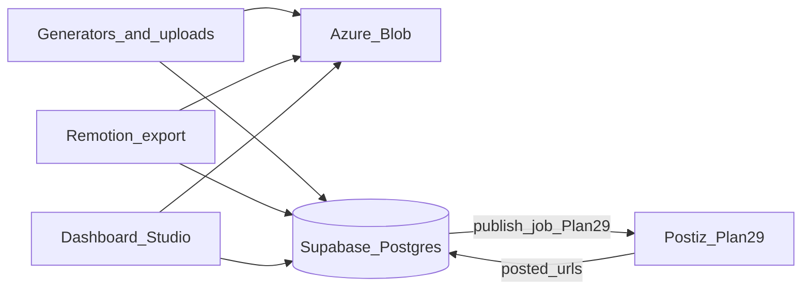

# Storage and persistence

After media is generated, Synawood needs **both**:

1. **Object storage** — the bytes (MP4, PNG, WAV, uploads, brand stills)
2. **Relational database** — names, history, jobs, costs, project JSON pointers, publish state

The git `products/{name}/content/` tree remains a **human/runbook mirror** (Briefs, copy drafts, published URL notes). It is **not** the system of record for binary media.

See [ADR-0009](../adr/0009-blob-and-postgres.md).

## Committed split

| Concern | Store | Why |
|---|---|---|
| Media binaries | **Azure Blob Storage** | Founder-preferred; CLI-authenticated ops; large video-friendly |
| Metadata + history | **Supabase Postgres** | New Synawood project (free plan to start); migrations in-repo |
| Briefs / copy markdown | Git under `products/{name}/content/` | Reviewable in PRs; runbook-native |
| Secrets | `.env.local` (local) / Vercel env (deploy) | Never in Blob or git |



## Azure Blob

### Access

- **Runtime (app):** Azure SDK with connection string / service principal from env (`AZURE_STORAGE_*`).
- **Ops / agents / setup:** **Azure CLI** (`az storage …`) — assume the developer machine is already authenticated. Prefer CLI for bucket/container bootstrap, one-off uploads, and debugging; do not require interactive Azure login inside the Next.js request path.

### Layout (conceptual)

```
marketing-os/{productId}/
  brand-kit/…           # optional mirrored kit binaries
  uploads/{projectId}/… # founder footage
  generated/{jobId}/…   # image / video-clip / tts outputs
  renders/{projectId}/{renderId}/final.mp4
  renders/.../still.png
  finals/{projectId}/{finalAssetId}/…  # immutable Approve copies
```

- Private containers by default; short-lived signed URLs for Player / download.
- Studio Media bin thumbnails use an authenticated same-origin proxy (`GET /api/studio/projects/{id}/assets/{assetId}/content`) so SVG/XML quirks and SAS races do not show browser broken-image icons; Remotion may still use short-lived SAS.
- Soft-delete or versioning on for Approve history.
- On Approve: copy render outputs into `finals/…`, insert retained `assets` rows, insert `final_assets` (idempotent on `project_id` + `render_job_id`). Render blobs stay; Finals are the publishable copies.
- Blob path is stored on the DB `assets.blob_key` — never only in chat.

### Local vs cloud Blob

| Mode | Behaviour |
|---|---|
| **Local default** | Use real Azure Blob with a **dev** container/prefix (`…/local/` or separate storage account) — same code path as prod |
| **Optional offline** | Local filesystem / Azurite only if explicitly enabled for airplane mode; not the happy path |

Do not invent a second persistence API for local — same adapters, different env.

## Supabase Postgres — what we track

New **Synawood** Supabase project (not the private example’s `demo` project). Free plan is fine until limits hurt.

Minimum tables (names illustrative):

| Table | Holds |
|---|---|
| `products` | Product context id, slug |
| `studio_projects` | Timeline JSON / jsonb, status, composition, model profile |
| `assets` | id, kind, blob_key, source (`upload`\|`brand_kit`\|`generator`), probe, created_at |
| `generation_jobs` | status, role, model_id, cost, input snapshot, output asset_id |
| `render_jobs` | status, output asset ids, duration, error |
| `cost_events` | ledger rows ([pricing-and-cost.md](./pricing-and-cost.md)) |
| `content_slots` | week, channel, brief pointer, linked project_id |
| `final_assets` | approved render → canonical asset; week path mirror |
| `publish_records` | channel, scheduled_at, posted_at, external_url, postiz_id, status |

- Schema via SQL migrations in-repo (`supabase/migrations/` or equivalent).
- **Local first:** `supabase start` (or linked remote free project with local app) — see [local-first.md](./local-first.md).
- App talks via Supabase JS / Postgres URL from env; RLS policies required before any public URL exposure.

History = rows + job snapshots + blob versions — not “hope the filesystem still has the file.”

## Filesystem vs DB

| In git `content/` | In Supabase + Blob |
|---|---|
| Brief markdown, post copy | Studio Project, assets, jobs |
| `published/{week}/` notes + URLs | `publish_records` + Final asset blob keys |
| Human batch checklist | Week board query |

On Approve: copy Final media into Blob under `finals/…`, insert retained `assets` + `final_assets`, optionally write a small markdown pointer into `content/drafts/{week}/final/README.md` so runbooks still work.

## When this is required

**Studio parallel track needs Blob + Supabase from the first working Generate/Export** — not deferred to Phase 2.

Postiz is Plan 29 (`core/channels` adapter). Storage/DB were required before that wiring.
