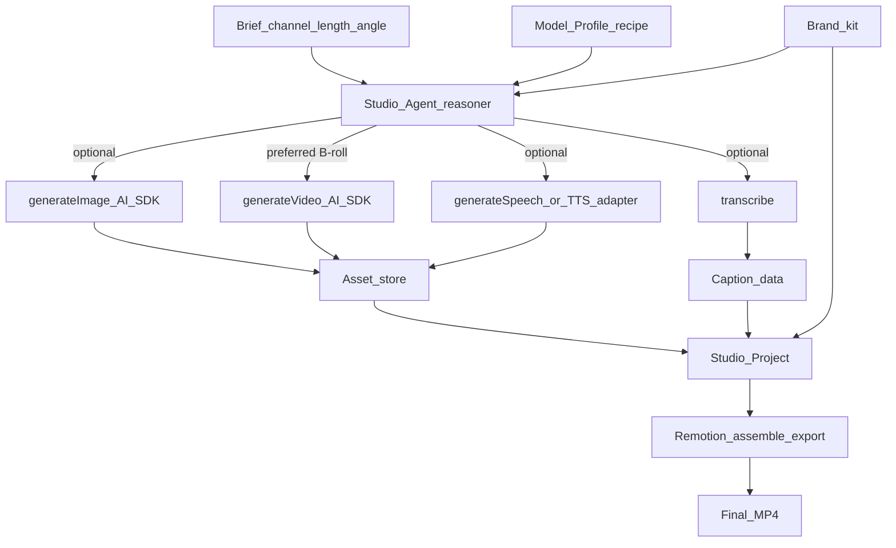

# How video is generated (exact path)

Creative Studio does **not** ask one model to “make a finished ad.” Video is produced in layers.



## Two meanings of “video”

| Kind | What it is | Who makes it |
|---|---|---|
| **Video clip asset** | Short AI clip (B-roll, motion from still, mood shot) | Video Generator via Vercel AI SDK (`experimental_generateVideo` / Gateway video models) |
| **Final asset** | Channel-ready **30–120s** ad with **video, music, and brand** | Approve after the agent produces it (ADR-0049). Encoding may use Remotion or not. |

A generator MP4 that already has **video + music + brand** for the requested length **may** be the Final after Approve (ADR-0049). An unbranded silent clip may not.

**Library-first B-roll (Wave 2I):** retrieve Moments from the product index, place shots on `track_broll`, generate-to-fill only the gaps. Contract: [ADR-0047](../adr/0047-intelligent-broll-assembly.md), [broll-assembly.md](./broll-assembly.md). Live clip adapter: [ADR-0048](../adr/0048-live-video-clip-generator.md).

## Default production recipes (v1)

Recipes are **defaults**, not hard locks — see [model-registry.md](./model-registry.md).

### Recipe A — Founder talking-head (primary risk mitigator)

1. Upload founder take → asset.
2. Reasoner model writes/refines hook + caption plan (tool loop).
3. `transcribe_media` → captions.
4. Optional: `generate_image` / `generate_video_clip` for B-roll only.
5. Remotion composition `talking_head_60` + Path C brand chrome → export.

**Video models:** usually unused, or 1–2 short B-roll clips max.

### Recipe B — Synthetic product short (no/little footage)

1. Reasoner drafts script + shot list from Brief + marketing skill + Brand kit.
2. `generate_image` for key frames / infographic bases (BrandPromptContext + refs).
3. **Text-to-video** (`generate_video_clip` with prompt) for synthetic B-roll; **image-to-video** when a branded still already exists (`sourceImageAssetId`). Both are valid. Do not skip t2v.
4. `generate_voiceover` (TTS) + captions.
5. Remotion assembles clips + VO + chrome → export.

### Recipe C — Infographic / slideshow (carousel + vertical)

Full design: [slideshow-infographics.md](./slideshow-infographics.md).

1. Pick channel preset (`ig_carousel_1080`, `tiktok_slideshow_9x16`, …).
2. `plan_slideshow` → `slides[]` (headline/body/duration/VO cues).
3. Backgrounds via `generate_slide_background` or Brand kit stills; **Path C text** in Remotion.
4. Optional VO; export **stills**, **MP4**, or **both**.

## AI SDK calls (conceptual)

```ts
import { generateImage, experimental_generateVideo as generateVideo } from 'ai'

// Image — stable generateImage
await generateImage({
  model: profile.imageModel, // from Model Profile
  prompt: brandBoundPrompt,
  aspectRatio: '9:16',
})

// Video — experimental API; prefer image+text when brand still exists
await generateVideo({
  model: profile.videoModel,
  prompt: { image: brandStillUri, text: motionPrompt },
  duration: 5,
  aspectRatio: '9:16',
})
```

Provider IDs come from the active **Model Profile** (Gateway or direct provider packages). Adapters stay thin: profile → SDK call → `AssetRef` + cost estimate.

## Starter model defaults (changeable in UI / config)

These are starting points for the private example Phase 1 parallel track — **swap via Model Profile**:

| Role | Starter default (illustrative) | Notes |
|---|---|---|
| Reasoner (Studio Agent) | Strong tool-calling chat model via AI SDK/Gateway | Not a video model |
| Image | Gateway/Flux or Imagen-class image model | Brand refs when supported |
| Video clip | Gateway Veo / Kling / Luma-class (t2v + i2v) | Text-to-video required; i2v when a still exists; generate until the ad is 30–120s |
| TTS | ElevenLabs or AI SDK `generateSpeech` if profiled | Voice id from Brand kit |
| STT | Whisper / AI SDK `transcribe` | Word timestamps for captions |

Exact string model IDs live in `Model Profile` config (env + dashboard), not hard-coded in Remotion compositions.

## Latency and jobs

- Image: often seconds → may run inline or as Generation Job.
- Video: tens of seconds → **always** Generation Job; chat returns job id.
- Live adapter (#516 / ADR-0048 / **ADR-0084**): family adapter shapes the request. `mock-*` / `placeholder/` / `disabled` stay stub bytes. Frozen ids (ADR-0085) never call Gateway. Failures throw — no silent mock substitution. Prefer i2v when `sourceImageBytes` is passed. Extra stills go as `inputReferences` when the **family** supports them. Over the family stills cap, fail before Gateway (`preflightVideoGenerate`).
- Paid make-an-ad: Generation Plan then confirm ([generation-plan.md](./generation-plan.md)).
- Remotion encode: Render Job after timeline is ready.

## Founder smoke — Wan 3.0 + MiniMax H3 (#1070)

Night shift and CI must **not** run these. They spend `AI_GATEWAY_API_KEY`. Picker rows stay off until an id returns usable bytes on this machine.

Local, with Allow paid models on and a wallet that can debit:

1. Studio footer Video: ids are adapter-allowlisted, not picker rows. Use chat Execute: generate a 6s clip with `alibaba/wan-v3.0-video` (t2v, then i2v with one still).
2. Same for `minimax/minimax-h3` t2v (4–15s). Optional: i2v / first-last / extra refs if Gateway accepts `inputReferences`.
3. Same for `minimax/minimax-h3-max` t2v (5–15s), then one start image. Extra refs should fail preflight before spend.
4. Pass for an id = MP4 bytes + duration. Fail for that id = leave it out of `GATEWAY_VIDEO_MODELS`.
5. `minimax/minimax-m3` is the chat reasoner. Do not send it to `generateVideo`.

## Quality gates before Approve

- Brand kit attached (Path C will apply).
- Duration ≤ Brief max (e.g. 60s).
- Hook title + end card present for ad recipes.
- Cost for the project logged and under remaining budget (see [pricing-and-cost.md](./pricing-and-cost.md)).
