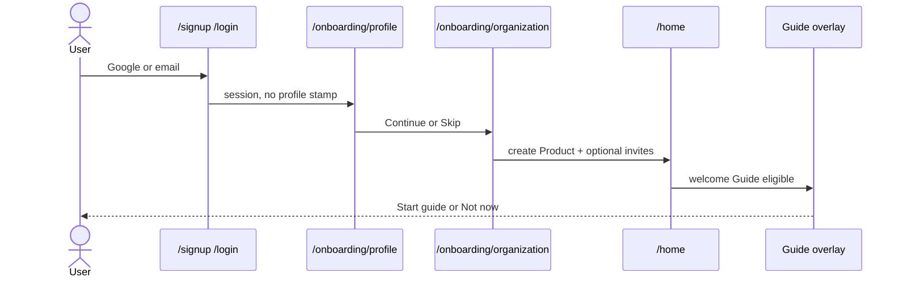

# SaaS operating model

How Synawood becomes a product other companies can sign up for, without inventing a second tenancy stack.

**Decisions:** [ADR-0067](../adr/0067-saas-public-identity.md) (public login), [ADR-0068](../adr/0068-organization-is-product-tenancy.md) (organization = Product row), [ADR-0069](../adr/0069-dismissable-product-guides.md) (tours).  
**Amends:** [ADR-0024](../adr/0024-product-auth-and-membership.md) access and copy.  
**Implementation:** [architecture/saas-identity.md](../architecture/saas-identity.md).  
**Flows:** [ux/saas-onboarding.md](../ux/saas-onboarding.md), [ux/product-guides.md](../ux/product-guides.md).

This is **not** billing, SSO, usage-based invoices, or a marketplace. Those need later ADRs. This program is the identity and first-run layer a paying customer would already expect.

---

## 1. Why this exists

Today the app is a **founder console with extra chairs**. Google login works. Members and invites work. Creating a Product works. Strangers cannot get in unless their email is on `AUTH_ALLOWLIST_EMAILS` or they hold an invite. The landing page is waitlist-first.

That is the right shape for an in-house OS. It is the wrong shape for SaaS:

| In-house console | SaaS product |
|---|---|
| Founder allowlists colleagues | Anyone can create an account |
| “Create a Product” (GTM jargon) | “Set up your organization” (team jargon) |
| Empty dashboard if you skip setup | Skippable personal questions; you still must belong to a team |
| No first-run teaching | Dismissable guide on first login |
| Features appear in the changelog | Next login after a release offers a short guide |

Success for this program is **not** “we added Stripe.” Success is: a stranger can create an account, skip the personal questions, name their team, invite one person into the **same** Members screen we already have, and dismiss a welcome guide without being trapped.

---

## 2. What we already have (do not rebuild)

| Capability | Where it lives | SaaS reuse |
|---|---|---|
| Auth users + cookies | Supabase Auth, `/login`, `/auth/callback` | Keep. Open the gate. |
| Tenancy | `products` + `product_members` + `product_invites` | Keep. Call it Organization in the UI. |
| Roles | `owner \| editor \| viewer` plus ADR-0037 `functional_role` | Keep. Do not duplicate on the profile. |
| Members UI | `/settings/members` | Canonical roster. Onboarding only *sends* invites. |
| Waitlist | `/` + `POST /api/waitlist` | Keep as marketing. Not the only door. |
| Allowlist | `AUTH_ALLOWLIST_EMAILS` | Ops valve (`allowlist` / `invite_or_allowlist` modes). |

A customer named Acme creates an Organization named Acme. The database row is still `products`. This repo does not ship a the private example GTM folder.

---

## 3. The four objects (do not collapse them)

```text
Account (auth.users)
    └── User profile (who I am — skippable)
            └── Memberships (product_members)
                    └── Organization / Product tenancy (products)
                            └── Invites, Studio, brand, pipeline…
    └── Guide progress (per user, not per org)
```

| Object | Question it answers | Skip? |
|---|---|---|
| **Account** | Can this email sign in? | No |
| **User profile** | What should we call you? What do you do? | **Yes** |
| **Organization** | Which team’s Studio and members is this? | No, unless they already joined or hold an invite |
| **Guide** | Have they seen this tutorial? | **Yes** (dismiss) |

Job title on the profile is **not** ADR-0037 `functional_role`. An invitee can be “Marketer” as a person and `publisher` on this Organization.

---

## 4. Actors

| Actor | How they arrive | What they must do |
|---|---|---|
| **Stranger** | `/signup` or Google | Account → profile (skip ok) → create Organization or paste invite |
| **Invitee** | Email + `/invite/[token]` | Account if needed → profile (skip ok) → accept → land in that Organization |
| **Returning member** | `/login` | Skip onboarding. Maybe a feature Guide if one shipped since last login |
| **Owner** | Already in | Invite/revoke on Settings → Members (unchanged APIs) |
| **Ops / founder** | `AUTH_ACCESS_MODE=allowlist` | Staging or emergency lock. Not the customer default |

Waitlist signups are **not** accounts. They get a confirmation email (existing #340 behaviour). Converting waitlist → account is a later growth task, not this program.

---

## 5. Lifecycle (happy path)



**Invitee:** after Auth, profile (optional), then `/invite/[token]` instead of create Organization. Members list already shows them.

**Returning user after a feature ships:** Auth → `/home` → at most one feature Guide modal (ADR-0069). Not now dismisses that Guide id forever unless they reopen it in Settings.

---

## 6. Organization vs Product (system rule)

**In code and SQL:** `product_id` is the tenancy key. Blob prefix `marketing-os/{productId}/`. Folder `products/{slug}/` for GTM sources. RLS helpers `is_product_member`. Cookie `synawood-active-product`.

**In customer chrome:** “Organization” means that same row — the company or team that owns Studio, brand, and the members list.

**In GTM docs and `CONTEXT.md`:** “Product context” means customer brand and claims on that Organization. Do not restore `products/demo/` into git.

When a customer has two marketed products under one company, v1 is **two Organizations** (two Product rows) or they use one Organization and two Studio Projects. A parent billing org is a **future ADR**, not a silent `organizations` table in this program.

---

## 7. What “proper login” means here

1. `/login` and `/signup` are public, branded, and complete (Google first, email second).
2. Failed auth is a sentence on the page, not a blank `/auth/callback`.
3. `AUTH_ACCESS_MODE=saas` does not consult the allowlist for ordinary customers.
4. Invite emails still authenticate even in stricter modes (existing invite bypass).
5. Session is the same cookie stack. We do not introduce Clerk/Auth0 in this program.

Abuse controls that **are** in scope: Supabase email confirmation for password signup; rate limits on `/api/auth/allowlist-check` and signup; fail-closed allowlist when mode is `allowlist` and the list is empty in production.

Abuse controls that are **out**: captcha vendor, device fingerprinting, SOC2 narrative.

---

## 8. What onboarding collects

**Profile (short, skippable):**

- Display name
- Job (founder / marketer / editor / other)
- Intent (make ads / run GTM / exploring) — optional third field; drop it if the form feels long

**Not collected in v1:** phone, company size, address, card, tax id, “how did you hear” (analytics can wait).

**Organization:**

- Name → `products.name`
- Slug → `products.slug`
- Optional teammate emails → existing invite API
- Optional one-line “what you sell” only if we already have a place to put it without a new company table

Skip profile: persist a row so we never ask again. Skip organization: **forbidden** if they have zero memberships and no invite. The empty state is create-or-join, not Studio with a missing Product.

---

## 9. Guides in the operating model

Guides are **product education**, not Studio Agent turns, not Intercom snippets, not git tags.

| Trigger | Guide kind | Cadence |
|---|---|---|
| First time a new user can actually work (has an Organization) | `welcome` | Once |
| Feature PR that changes a named surface | `feature` | Next login after `released_at`, once, unless dismissed |

Dismiss is sacred. A new Guide **id** is how we teach a new thing. We do not resurrect a dismissed id on deploy.

One Guide prompt per login. Queue extras for the following login (ADR-0069).

---

## 10. Boundaries (what this program does not own)

| Topic | Owner |
|---|---|
| Stripe / plans / seats | [ADR-0082](../adr/0082-hosted-billing-wallet-entitlements.md), [billing.md](./billing.md) |
| SSO / SAML / SCIM | Future enterprise ADR |
| Public Product directory | Never (ADR-0024 / UX non-goal) |
| Auto-creating a the private example (or any example) Product for every signup | Never |
| Replacing members/invites | Never — extend only |
| Studio Agent harness | ADR-0001 — Guides are chrome |
| Opening spend with no cap | Existing ledger + confirm-before-generate |

System-design [boundaries.md](./boundaries.md) still applies: product-agnostic code in `core/`, UI in `dashboard/`, marketed-product copy in `products/{name}/`. SaaS identity lives in `dashboard/` + `supabase/migrations/`, not in an example Product folder.

---

## 11. Success and kill rules (this program)

**Ship it if:**

1. A new email can sign up on a `saas`-mode preview without being allowlisted.
2. Skip on profile still produces a working Organization owner.
3. Invites created on the org step appear on `/settings/members` with the same revoke/resend behaviour.
4. Welcome Guide can be dismissed and stays dismissed after reload and a second browser (server progress).
5. A feature Guide with `released_at` in the past appears on the **next** login for a user whose previous `last_login_at` was before that timestamp, and not again after dismiss.

**Kill / slip if:**

- We add `organizations` and a second invite table “to match the copy.”
- Skip is fake (required fields, or Skip still blocks `/home`).
- Guides store only in `localStorage`.
- Production flips to `saas` before the org step and Guides exist (strangers in a broken shell).

---

## 12. Rollout sequence (ops)

1. Land docs (this file + ADRs + UX/UI).
2. Schema + APIs behind `AUTH_ACCESS_MODE=invite_or_allowlist` (current behaviour).
3. Profile + organization UX on `/onboarding/*`.
4. Guide engine + welcome catalogue entry.
5. Dogfood `saas` on a Vercel preview.
6. Flip production `AUTH_ACCESS_MODE`. Keep allowlist populated for emergency `allowlist` mode.
7. Feature Guides become part of user-visible PR definition of done.

Local-first still applies: founder reviews localhost before the production mode flip ([local-first.md](../architecture/local-first.md)).
